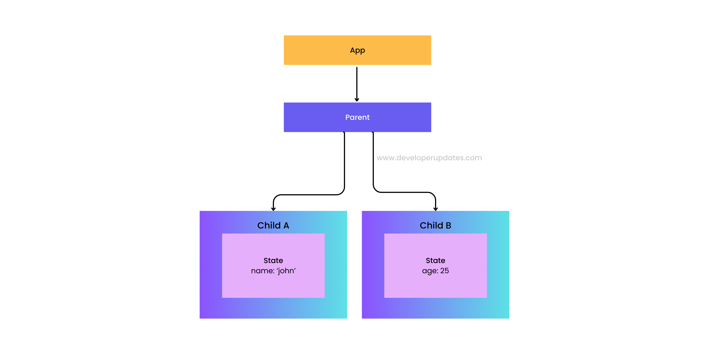
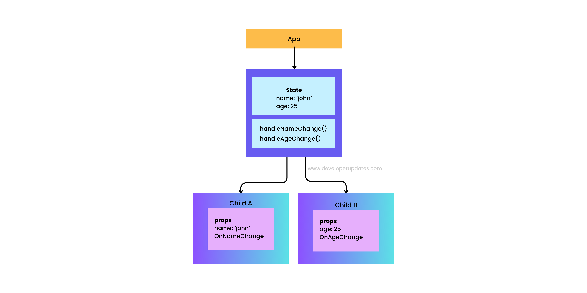

# Lifting State Up
Lifting state up is a technique in react to shared state between two components
> It is necessary when multiple components need to access and/or modify the same state.
> Child components can received the shared components via props

### Architecture
**Without Lifting State**


**With lifting state**


This way, instead of multiple components managing their own state copies.
The state is managed by a single component and passed down to other components.

> Lifting state up promotes a unidirectional data flow.
Data flows down from the parent component to child components through props.
Any state updates are achieved by calling functions passed down from the parent component.
This makes the app more predictable and easier to debug.


### Example with lifting
```
import React, { useState } from 'react';
const App = () => {
  const [name, setName] = useState(' ');
  const [age, setAge] = useState(' ');

  const handleNameChanged = e => {
    e.preventDefault();
    setName(e.target.value);
  };
  const handleAgeChanged = e => {
    e.preventDefault();
    setAge(e.target.value);
  };

  return(
    <>
    <NameInput name={name} handleNameChanged={handleNameChanged} />
    <AgeInput age={age} handleAgeChanged={handleAgeChanged} />
    </>
  )
};
export default App;


const NameInput = ({name, handleNameChanged}) =>{
  return (
    <>
    <div>
    <label htmlFor="name">Enter Name</label>
    <input type="text" name={name} onChange={handleNameChanged} />
    </div>
    </>
  )

} 

const AgeInput = ({age, handleAgeChanged}) =>{
  return(
    <div>
    <label htmlFor="age">Age</label>
    <input type="text" age={age} onChange={handleAgeChanged} />
    </div>
  )
}

```

## Why Use
1. Make sibling component communicate via parent
2. prevent duplicate state
